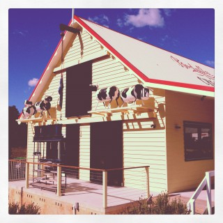

# Responsive Image

This script checks if an image is larger than a specified width, then loads in a higher resolution image, choosing the most appropriately sized image for the current viewport measurements. This is an [ExpressionEngine](http://expressionengine.com/) focussed implementation, but can be adapted easily for use elsewhere.

#### Method

* Adhering the the principles of mobile first, the smallest image is included in the markup
* We use an `id="responsiveimage"` on the`img` element to trigger the magic
* No additional `class`es or `data` attributes pointing to other image sources are required
* Automatically created images at multiple sizes, using EE, are waiting in the wings
* The script compares the viewport width to a number of breakpoints in the script
* And switches the path to the most appropriately sized image

#### EE

The reference to being ExpressionEngine specific refers to the use of the [Image Manipulations](http://expressionengine.com/user_guide/cp/content/files/file_upload_preferences.html#image-manipulations) within EE’s File Upload Preferences. Four copies of the image have been created automatically, constrained to widths of 320, 480, 768 and 980px for this example. Because the manipulations are stored in directories, our focus shifts to changing the path.

#### Credits 

Inspiration from [Automatic Responsive Images in WordPress](http://viewportindustries.com/blog/automatic-responsive-images-in-wordpress/) by Keir Whitaker. Based on the elegant [Responsive-Enhance](https://github.com/joshje/Responsive-Enhance) by Josh Emerson. Justification for a double download from [Image-y Nation](http://adactio.com/journal/5208/) by Jeremy Keith. Path changing regex magic provided by [Myles Eftos](http://twitter.com/#!/madpilot).

#### HTML

    <!DOCTYPE html>
    <html lang="en">
    <head>
    	<meta charset="utf-8" />
    	
    	<title>Responsive Image</title>
    	<meta name="viewport" content="width=device-width, initial-scale=1">
    </head>
    <body>
    	
    </body>
    
    
    </html>

#### Javascript

	var addEvent=function(){return document.addEventListener?function(a,c,d){if(a&&a.nodeName||a===window)a.addEventListener(c,d,!1);else if(a&&a.length)for(var b=0;b<a.length;b++)addEvent(a[b],c,d)}:function(a,c,d){if(a&&a.nodeName||a===window)a.attachEvent("on"+c,function(){return d.call(a,window.event)});else if(a&&a.length)for(var b=0;b<a.length;b++)addEvent(a[b],c,d)}}();
	
	var responsiveImage = function(img, width, monitor) {
		
		if (img.length) {
			for (var i = 0, len = img.length; i < len; i++) {
			  responsiveImage(img[i], width, monitor);
			}
		}
		
		else {
			
			var _size = '_320'; // base size
			var _src = img.src;
			
			if (img.clientWidth > 320 && img.clientWidth < 481) {
				_size = '_480';
				var responsiveimg = new Image();
				addEvent(responsiveimg, 'load', function(e) {
			      img.src = this.src;
			  });
			  responsiveimg.src = _src.replace(/(\/img\/)(_\d+)(\/.+)/, '$1' + _size + '$3');
			}
			
			if (img.clientWidth > 480 && img.clientWidth < 769) {
				_size = '_768';
				var responsiveimg = new Image();
				addEvent(responsiveimg, 'load', function(e) {
				    img.src = this.src;
				});
				responsiveimg.src = _src.replace(/(\/img\/)(_\d+)(\/.+)/, '$1' + _size + '$3');
			}
					
			if (img.clientWidth > 768) {
				_size = '_980';
				var responsiveimg = new Image();
				addEvent(responsiveimg, 'load', function(e) {
				    img.src = this.src;
				});
				responsiveimg.src = _src.replace(/(\/img\/)(_\d+)(\/.+)/, '$1' + _size + '$3');
	}
			
			console.log('viewport = ' + img.clientWidth + ' therefore image size = ' + _size);
		}
		
		if (monitor != false) {
			addEvent(window, 'resize', function(e) {
			  responsiveImage(img, width, false);
			});
			addEvent(img, 'load', function(e) {
			  responsiveImage(img, width, false);
			});
		}
	};

#### Notes

There’s no doubt in my mind that somebody smarter than I would be able to drmatically improve and shorten this script. For example, I imagine it could be shortened into a loop, with an easy-to-edit array of breakpoints included at the top, which also control the loop. Early days.